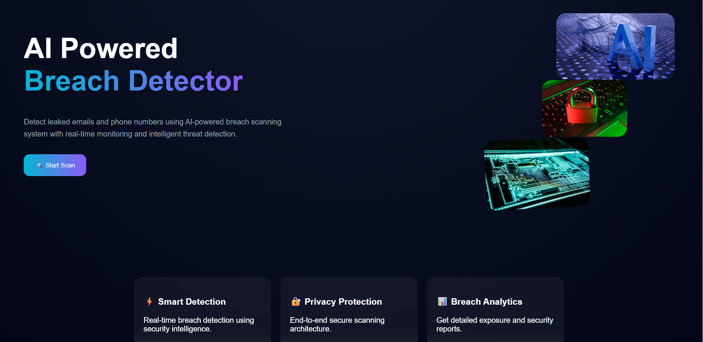
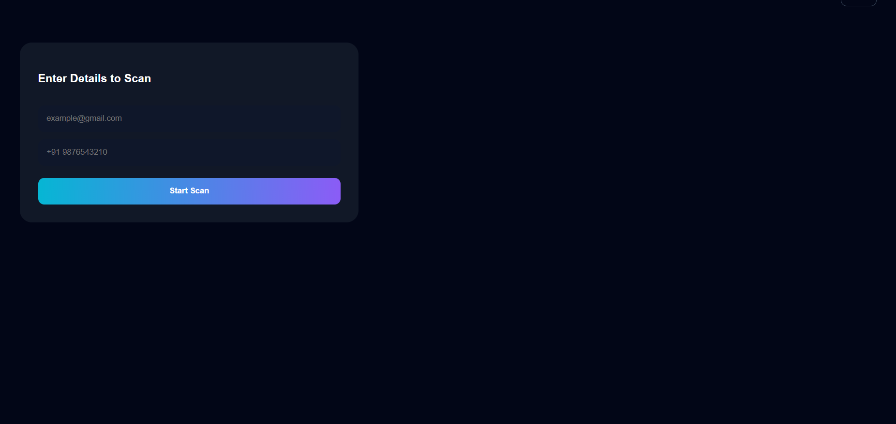
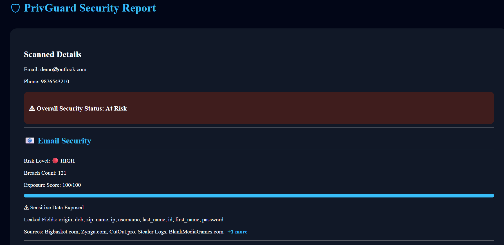

# PrivGuard 🛡️

PrivGuard is a cybersecurity platform that helps users detect whether their email or phone number has been exposed in public data breaches.

---

# ✨ Features

- Email breach detection
- Phone breach detection
- Real-time security scanning
- Risk score analysis
- Exposure report generation
- Loading spinner + progress bar
- Smart breach source display

---


---


# 🚀 Installation

## Clone Repository

```bash
git clone https://github.com/ganavigirish/Breach-Detector.git
```

---


# 🌐 API Endpoint

```bash
POST /api/exposure/scan
```

---

# ⚙️ How It Works

1. User enters email or phone number
2. Frontend sends request to backend API
3. Backend scans breach intelligence data
4. Security risk is analyzed
5. User receives a detailed security report

---

# 🔮 Future Scope

- Dark web monitoring
- Password strength checker
- Threat prediction
- OTP verification
- AI-powered recommendations

---

# 📸 Screenshots

## Home Page



---

## Scan Page



---

## Security Report



---


# 📌 Live Demo

Frontend: [Live Demo](https://privguard-frontend-d30u.onrender.com)

Backend API: [API Server](https://privguard-backend-7r5j.onrender.com/)

---

# 📄 License

This project is for educational and hackathon purposes.

## ⚠️ Important Note About Breach Data

This project currently uses the free version of the LeakCheck API for educational and demonstration purposes.

Because of free API limitations, the application can only access **publicly available breach records** that are already exposed on the internet.

### What This Means

* If you enter a real email address or phone number, the application will only display breaches that are publicly searchable.
* Private, premium, or restricted breach intelligence databases are NOT accessible in the free tier.
* The displayed results are meant for awareness and cybersecurity learning purposes only.

### Paid Breach Intelligence Services

Advanced paid services can provide deeper breach intelligence and larger datasets, including private or premium breach collections.

Examples include:

* LeakCheck Premium
* Intelligence X
* DeHashed
* SpyCloud
* Constella Intelligence
* HaveIBeenPwned Enterprise APIs


### Sample Test Credentials

You can test the application using sample/demo inputs such as:

#### Sample Emails

* [demo@outlook.com](mailto:demo@outlook.com)
* [test@gmail.com](mailto:test@gmail.com)
* [sample@yahoo.com](mailto:sample@yahoo.com)

#### Sample Phone Numbers

* 9876543210
* 9123456780
* 9000000000

> Do NOT use sensitive personal credentials while testing public demo applications.
